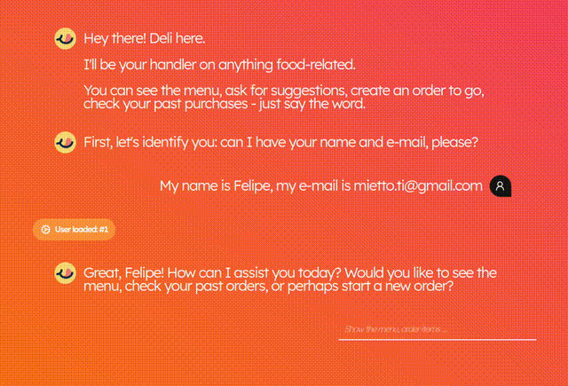
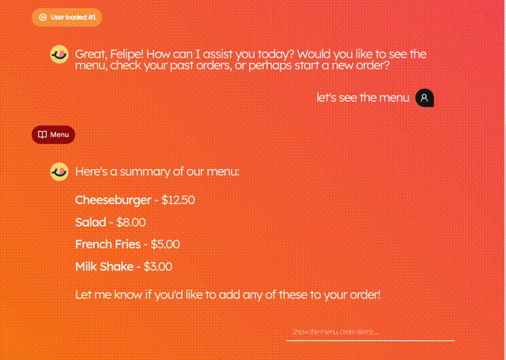
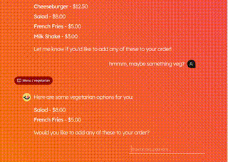
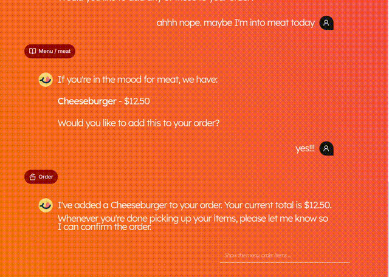

# FELIPE MIETTO

`dev; arch; maker;`

## ABOUT

`>_ softskills`

> Seasoned dev, with 12+y experience on diverse technical and business contexts. Lover of architecture and _serious tooling_, to enable the best developer workflow possible.
>
> Throughout my career, I've taken the _Ownership_ concept as my motto - being accountable for your piece among the whole of a project encourages us to think through the whole development life cycle and deliver our best.
>
> Project standards, observability with relevant metrics, development process, in short: these are some of the things I like to keep my eye on. Being involved in the software development life cycle as a whole.

## TOOLING

`>_ hardskills`

> `frontend`: **React.js**, **Next.js**, **Astro**, TypeScript, JavaScript, HTML, CSS, GraphQL, WebComponents
>
> `backend`: **Node.js**, **Typescript**, **NestJS**, **gRPC**, **Fastify**, Drizzle ORM
>
> `devops`: CI/CD, **GitLab Pipelines**, **GitHub Actions**, Jenkins, Azure Devops
>
> `infra`: **AWS**: EC2, Lambda, CloudFront, API Gateway, SQS, EC2, S3. **Docker**: Kubernetes, Kong, Helm Charts
>
> `data`: **PostgreSQL**, **MongoDB**, DynamoDB, Redis, Kafka, Elastic/ELK
>
> `arch`: Micro Services, Micro Frontends, Design Patterns, Observability,

## PROJECTS

`>_ work`

### Deli.AI

  
Screenshots

  

    
    
    
    
  

