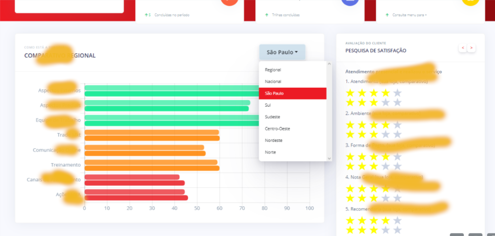

# FELIPE MIETTO

`dev; arch; maker;`

## ABOUT

`>_ softskills`

Senior Frontend Developer and Solutions Architect with 12+ years of experience in software development, specializing in modern tech stacks like **Next/React**, **Node/Nest**, **Hasura/GraphQL/gRPC**, **Javascript/TypeScript/Web APIs**.

Comfortable using cloud services such as **AWS**, **Vercel**, **GCP** or **Cloudflare**, including IaC scripting.

Proven expertise in building **scalable**, **high-performance** systems, joining _business_ and _architecture_ reqs into extensible and **_future-proof_** software.

Interest and active contribution on **_team's best practices and processes_** definitions, for better **code quality**, **DevX** and measurable productivity results.

## TOOLING

`>_ hardskills`

> `frontend`: **React**, **Next**, **Astro**, TypeScript, JavaScript, HTML, CSS, GraphQL, WebComponents
>
> `backend`: **Node.js**, **Typescript**, **NestJS**, **gRPC**, **Fastify**, Drizzle ORM
>
> `devops`: CI/CD, GitLab Pipelines, **GitHub Actions**, Jenkins, Azure Devops, _plain old_ **bash**
>
> `infra`: **AWS**: EC2, Lambda, CloudFront, API Gateway, SQS, EC2, S3. **Docker**: Kubernetes, Kong, Helm Charts
>
> `data`: **PostgreSQL**, **MongoDB**, DynamoDB, Redis, Kafka, Elastic/ELK
>
> `arch`: Microservices, CQRS, Frontend architecture, Observability

## PROJECTS

`>_ work`

### Deli.AI

AI chatbot for restaurants customer service. Handles the entire user journey, using natural language. From Menu display, suggestions, until order creation and tracking.

Features embedding based search and recommendations, integration with local tool calling, generative UI, bringing interactivity to data and natural language responses.

All of that while still working with a standard NextJS application, structured SQL database and APIs, the whole deal.

  
Show More
 
  

    
    
    
    
    
  

### Ver+

Physical store and POS auditing platform, featuring:

- Mobile PWA, for field agents to collect info on the stores
- Stores Dashboard, so that each representative could take action on negative evaluations
- Management Dashboard, focused on analytics and metrics collection.

The platform quicly evolved beyond the auditing program, being used by 200+ field agents for several other processes.

  
Show More
 
  

    
    
    
    
    
  
 

